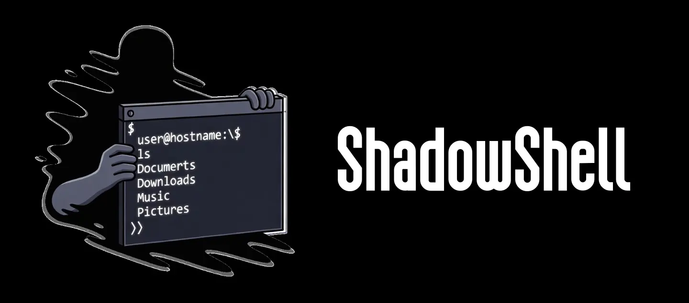
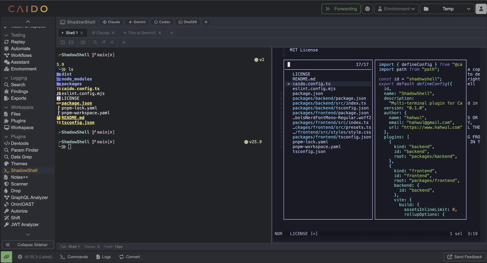
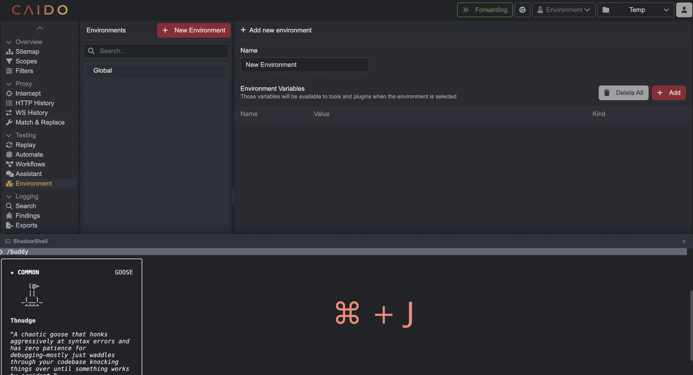
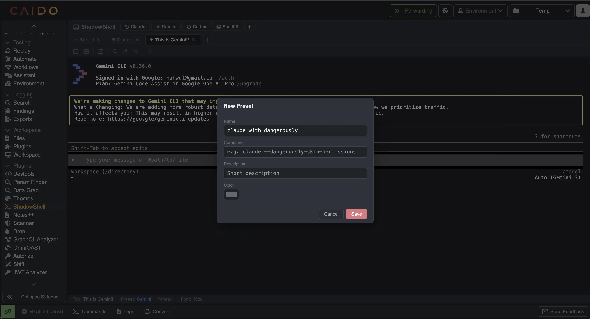

<!-- GitHub Description: Multi-terminal plugin for Caido with AI presets and instant Cmd+J access -->



Multi-terminal plugin for [Caido](https://caido.io) — run multiple terminals with split panes, switch between AI coding agents (Claude, Gemini, Codex) via presets, and press `Cmd+J` to drop down a terminal instantly from anywhere.





> [!NOTE]
> This plugin is a **temporary solution** until Caido ships native terminal support (see [caido/caido#1381](https://github.com/caido/caido/issues/1381)). Once that lands, ShadowShell will likely become redundant.

## Features

- **Multi-tab terminal** — Open multiple terminal sessions within Caido
- **Split panes** — Horizontal and vertical splits for parallel workflows
- **AI presets** — One-click launch for Claude, Gemini, Codex, or plain shell
- **Custom presets** — Add your own commands with custom names, colors, and descriptions
- **Quick access (`Cmd+J`)** — Drop-down terminal overlay from anywhere in Caido
- **Caido theme sync** — Terminal colors automatically follow your Caido dark/light theme
- **Search** — In-terminal search with prev/next navigation
- **Auto-resize** — Terminals fit to pane size with proper PTY resize signals
- **Configurable Python path** — Set a custom Python 3 path via the settings gear

## Built-in Presets

| Preset | Command | Description |
|--------|---------|-------------|
| Claude | `claude` | Anthropic Claude Code CLI |
| Gemini | `gemini` | Google Gemini CLI |
| Codex | `codex` | OpenAI Codex CLI |
| Shell | *(default)* | Default system shell |

All built-in presets can be customized (command, name, description), and you can add your own.



## Requirements

- **Python 3** — The backend uses a Python PTY relay to manage terminal sessions. Python 3 is auto-detected from common paths (`/usr/bin/python3`, `/usr/local/bin/python3`, `/opt/homebrew/bin/python3`), or you can set a custom path in Settings.

## Installation

Install from the Caido plugin store, or build from source:

```bash
pnpm install
pnpm build
```

## Disclosures

- **Python 3 subprocess**: The backend spawns a Python 3 process per terminal session to create and manage PTY (pseudo-terminal) pairs. The path is auto-detected or configurable via Settings. No external network calls are made by these processes.
- **Local TCP communication**: Each terminal session uses a localhost TCP port (range 18500–32767) for internal communication between the Node.js backend and the Python PTY relay. All traffic is local-only and never leaves the machine.
- **No telemetry or external services**: This plugin does not collect any data, send telemetry, or connect to external servers.

## Architecture

```
packages/
  backend/   # PTY relay (Python) + TCP bridge (Node.js)
  frontend/  # xterm.js terminals, tab/pane management, preset UI
```

The backend spawns a Python PTY relay per terminal session, communicating over a local TCP socket with length-prefixed JSON messages. The frontend renders terminals using xterm.js and manages tabs, splits, and preset configuration via localStorage.

## License

MIT
